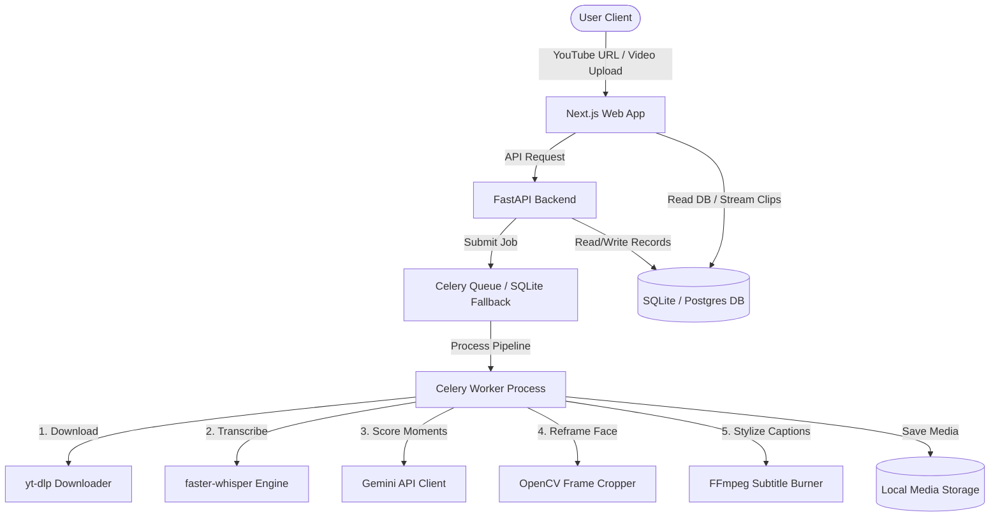

# ClipForge AI - AI-Powered Vertical Shorts & Subtitles Generator

ClipForge AI is a production-ready, full-stack application designed to automate the process of turning standard landscape widescreen videos (YouTube URLs or local uploads) into engaging 9:16 vertical short clips (for TikTok, YouTube Shorts, and Instagram Reels).

Powered by **Gemini 1.5 Flash** for viral segment scoring and **OpenAI Whisper** for word-level speech transcription.

---

## Technical Architecture



### Tech Stack
* **Frontend**: Next.js 15/16, React 19, TypeScript, Tailwind CSS v4, NextAuth
* **Backend**: FastAPI (Python), FFmpeg (`imageio-ffmpeg` portable bindings), OpenCV-Python, OpenAI Whisper (`faster-whisper`), `google-genai` (Gemini SDK)
* **Database**: PostgreSQL (Production) / SQLite (Development), Prisma ORM
* **Queue**: Celery, Redis (Production) / SQLAlchemy SQLite (Local development fallback)

---

## Directory Structure

```
AI-CLIPS-CUTTER/
├── backend/
│   ├── app/
│   │   ├── config.py           # Configuration manager (.env parsing)
│   │   ├── database.py         # SQLAlchemy engine & SQLite WAL config
│   │   ├── models.py           # Database models (matches Prisma fields)
│   │   ├── schemas.py          # FastAPI Pydantic schemas
│   │   ├── celery_app.py       # Celery queue worker setup
│   │   ├── tasks.py            # Async tasks (pipeline, clip-renderer)
│   │   ├── services/
│   │   │   ├── video.py        # yt-dlp & FFmpeg crop wrappers
│   │   │   ├── transcribe.py   # Local CPU INT8 Whisper service
│   │   │   ├── ai.py           # Structured Gemini JSON analyzer
│   │   │   ├── face_detection.py# Speaker face tracking & 9:16 cropper
│   │   │   └── subtitles.py    # ASS karaoke subtitle constructor
│   │   └── routers/
│   │       ├── projects.py     # Upload and submission routes
│   │       ├── clips.py        # Workspace edit & trimming routes
│   │       └── analytics.py    # Telemetry and admin dashboard routes
│   ├── tests/                  # PyTest mock test suites
│   ├── run_backend.bat         # Windows double-click runner
│   ├── Dockerfile
│   └── requirements.txt
│
├── frontend/
│   ├── src/
│   │   ├── app/                # Next.js App Router (Layouts & Pages)
│   │   ├── components/         # Providers and subcomponents
│   │   └── lib/                # Prisma client & NextAuth wrappers
│   ├── prisma/
│   │   └── schema.prisma       # Shared database schema
│   ├── run_frontend.bat        # Windows double-click runner
│   ├── Dockerfile
│   └── package.json
│
├── docker-compose.yml          # Container configuration
├── .env.example
└── README.md
```

---

## Local Installation (Windows Setup)

Prerequisites:
* **Node.js** `v24.16.0` or higher
* **Python** `3.12+` or `3.14+`
* *Note: FFmpeg does not need to be pre-installed! The backend uses the `imageio-ffmpeg` engine to resolve and execute FFmpeg binaries automatically.*

### Step 1: Environment Variables
Copy the `.env.example` file in the root workspace into a new file named `.env`, and fill in your **Gemini API Key**:
```ini
GEMINI_API_KEY="AIzaSyYourGeminiAPIKey..."
```

### Step 2: Set Up the Database & Frontend
Navigate into the `frontend/` folder, install JavaScript packages, and sync SQLite:
```bash
cd frontend
npm.cmd install
npx.cmd prisma db push
```

### Step 3: Run the Application (One-Click Batch Runners)
We have provided easy-to-use Command Prompt batch scripts that automate the launch sequence:
1. **Start Backend**: Double-click [backend/run_backend.bat](file:///c:/Users/anand/Desktop/AI%20CLIPS%20CUTTER/backend/run_backend.bat). This will run a pip install check, start a Celery background task worker, and start the FastAPI uvicorn server on `http://localhost:8000`.
2. **Start Frontend**: Double-click [frontend/run_frontend.bat](file:///c:/Users/anand/Desktop/AI%20CLIPS%20CUTTER/frontend/run_frontend.bat). This will boot up the Next.js client on `http://localhost:3000`.

Open [http://localhost:3000](http://localhost:3000) in your web browser.

---

## Running with Docker Compose

If you want to run the complete PostgreSQL and Redis stack containerized, execute the following from the root directory:
```bash
docker-compose up --build
```
This spawns:
* PostgreSQL (Port `5432`)
* Redis (Port `6379`)
* FastAPI Backend (Port `8000`)
* Celery Worker
* Next.js Frontend (Port `3000`)

---

## API Documentation
Once the backend is running, you can explore the interactive OpenAPI Docs directly:
* Swagger UI: [http://localhost:8000/docs](http://localhost:8000/docs)
* Redoc: [http://localhost:8000/redoc](http://localhost:8000/redoc)

---

## Running Automated Tests

Run backend unit tests verifying model pipelines and subtitle formatting:
```bash
cd backend
pytest -v
```
